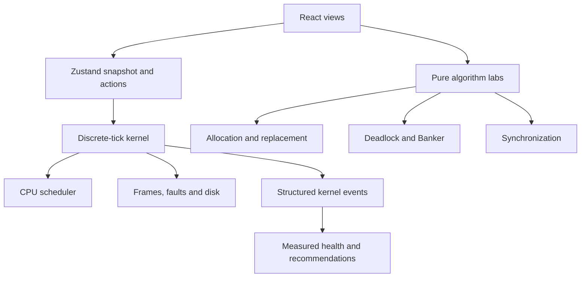

# SmartOS Lab

**Interactive Operating System Kernel Simulation & Visualization Environment**

SmartOS Lab is a desktop-first React application for demonstrating how an operating system coordinates CPU scheduling, process state, paging, I/O and interrupts under one simulation clock. It includes separate, testable labs for memory allocation, page replacement, deadlock, Banker's algorithm and synchronization.

## Problem statement

Operating System algorithms are often taught independently using static diagrams and numerical examples, making it difficult to understand how scheduling, memory management, interrupts, synchronization and resource allocation interact inside a running system. SmartOS Lab provides a shared simulation environment where these mechanisms can be observed together.

## Objective

Build an interactive kernel simulator that makes process management, CPU scheduling, memory, I/O, interrupts, virtual memory and resource allocation understandable through live events, a timeline, process control blocks and measured analytics.

## Run locally

Requires Node.js 20 or later.

```bash
npm install
npm run dev
```

Open the local URL printed by Vite. For a production build:

```bash
npm run build
npm run preview
```

Run the correctness tests with `npm test`. With Chrome installed, `npm run smoke` and `npm run features` start their own local server and check the browser UI.

## Demonstration sequence

1. Open **Live kernel**, select Round Robin and click **Step**. A process arrives, is scheduled, and generates a page-fault trap.
2. Keep stepping. The disk-completion interrupt loads the page, the process returns to Ready, and another process may run.
3. Open a PCB to inspect registers, remaining CPU work and its page table.
4. In the interrupt controller, request disk I/O for a process. Watch its state and device queue change.
5. Open **Scheduling** to compare the same workload under eight schedulers.
6. Open **Memory** to compare allocation and page replacement strategies and translate a virtual address.
7. Open **Resources** to inspect a deadlock and a Banker's safe sequence.
8. Open **Analytics** for measured charts, health formula and rule-based recommendations.
9. Use **Scenario lab** for repeatable presentation workloads or seeded chaos mode.

## Features and modules

| Area | Implemented behavior |
|---|---|
| Kernel dashboard | Clock, start/pause/reset/step, 0.5×–10× speed, queues, CPU/RAM map, searchable event log, per-tick timeline, PCB panel |
| Process management | Create, delete, terminate, suspend, resume, change priority; validated inputs |
| Scheduling | FCFS, SJF, SRTF, nonpreemptive/preemptive priority, Round Robin, multilevel queue, multilevel feedback queue; comparison and Gantt trace |
| Memory | First/Best/Worst/Next Fit, coalescing holes, page tables, frame table, swap trace, address translation, FIFO/LRU/Optimal/Clock comparison |
| Resources | Shared resource allocation table with PCB blocking and grants, multi-instance deadlock detector; separate Banker's Need matrix, safety status and sequence |
| Synchronization | Bounded-buffer semaphore counts, reader/writer exclusion, dining philosopher deadlock and avoidance demonstrations |
| Kernel control | Disk/keyboard/printer/network I/O requests, interrupts, state-changing system calls, simulated files with disk completion, live terminal commands |
| Analytics | Telemetry charts, utilization, wait/turnaround, context switches, anomalies, explainable weighted health score |
| Experiments | Ten scenario presets, seeded chaos, presentation mode, JSON/CSV export, JSON load, print, keyboard shortcuts |

The terminal supports `help`, `ps`, `top`, `kill PID`, `pause PID`, `resume PID`, `nice PID N`, `free`, `memory`, `scheduler`, `resources`, `deadlock`, `pages`, `interrupts`, `fork PID`, `exec PID NAME BURST`, `wait PID`, `exit PID`, `read PID FILE`, `write PID FILE TEXT`, `open PID FILE`, `close PID FILE`, `malloc PID KB` and `clear`.

Keyboard shortcuts outside text fields: **Space** pause/resume, **S** step, **R** reset, **N** focus new process, **1/2/5** speed.

## Architecture



See [ARCHITECTURE.md](ARCHITECTURE.md) for the data model, event order, tie-breaking and milestones.

## Folder structure

```text
src/
  core/
    types.ts          Process, PCB, event and kernel interfaces
    kernel.ts         Shared clock, CPU, paging, I/O, interrupts
    scheduler.ts      Eight schedulers and comparison
    memory.ts         Allocation, replacement, translation
    resources.ts      Deadlock and Banker's safety
    sync.ts           Semaphore and synchronization models
    analysis.ts       Health and anomaly rules
    scenarios.ts      Preset experiments
    core.test.ts      Algorithm and integration tests
  ui/
    App.tsx           Dashboard and laboratory views
    style.css         Base responsive layout
    refined.css       Light visual system
    ResourceLab.tsx   Shared resource graph and Banker controls
    SynchronizationLab.tsx  Interactive concurrency models
    KernelControls.tsx      Live actions and terminal
  store.ts            UI actions and experiment state
  main.tsx            React entry point
```

## Assumptions and limits

- This is an educational, deterministic simulator, not an OS or process executor. CPU bursts and device service times are integer ticks. A tick represents one unit of simulated time.
- The shared kernel has one CPU, zero context-switch duration, and FIFO frame eviction. The memory lab independently compares FIFO, LRU, Optimal and Clock. The scheduler comparison independently runs CPU-only workloads so the algorithms see identical bursts without I/O variation.
- Lower numeric priority means higher priority. Ties use arrival time and then PID. Quantum expiration queues the current process at the end. A process can be blocked by an I/O request or page fault and later returned to Ready.
- Contiguous allocation and page replacement are interactive algorithm experiments alongside the shared paging kernel. The resource graph now reads and writes the shared kernel resource table: pending requests block mapped PCBs, grants wake them, termination releases holdings, and deadlocks affect health and the event log. Banker's algorithm remains a separate what-if safety experiment.
- Reader/writer and philosopher simulations use deterministic queue and fork-ownership models. They do not execute real concurrent threads. `fork`, `exec`, `wait`, `exit`, `read`, `write`, `open`, `close`, and `malloc` change simulated process state; they do not invoke host OS calls. `open` creates a simulated file, `write` appends text and `read` records the content in the PCB after disk I/O completes.
- The health score is a teaching heuristic with its formula visible in Analytics. It is not an OS performance standard.
- A saved experiment JSON includes the current kernel snapshot and resource table. Loading restores its exact simulation tick and event history. Reset starts the configured workload again from time zero.

## Testing

`npm test` runs unit and integration checks with known outputs for scheduling, page replacement, allocation, address translation, Banker's safety, deadlock, synchronization, system calls, resource blocking, snapshot restore, and I/O transitions. `npm run build` runs strict TypeScript checking and creates production assets. `npm run smoke` checks every view and all ten scenarios in Chrome; `npm run features` exercises live controls and data flow.

Manual checks: start/pause/step/reset, create and suspend a process, trigger a disk request, inspect the PCB and logs, load every scenario, compare schedulers and page strategies, export JSON/CSV, reload the experiment and refresh the page.

## Screenshots

- `docs/screenshots/home.png` — landing page
- `docs/screenshots/dashboard.png` — live kernel dashboard
- `docs/screenshots/resources.png` — resource graph and Banker test

## Future extensions

TLB with hit-ratio metrics, priority aging, multi-core dispatch, configurable device service queues, and richer Banker request analysis.
